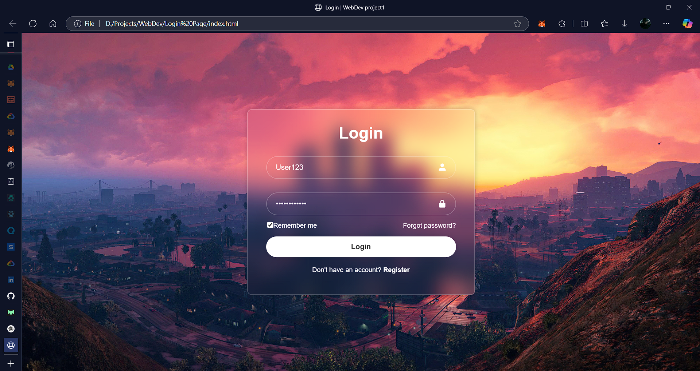

# 🌟 Login Page – WebDev Project 1  

## 📌 Overview  
This is a **modern and stylish login page** built with **HTML & CSS**. It features a **glassmorphism effect**, smooth UI design, and a responsive layout.  

## 🚀 Features  
- ✅ **Minimal & Aesthetic UI** with a blurred glass effect  
- ✅ **Fully Responsive** – adapts to different screen sizes  
- ✅ **Remember Me & Forgot Password** functionality  
- ✅ **Smooth Hover & Focus Effects** for better UX  

## 🛠️ Tech Stack  
- **HTML5** – Structure of the page  
- **CSS3** – Styling with **glassmorphism & animations**  
- **Boxicons** – Icons for better visuals  
- **Google Fonts** – "Poppins" for a clean, modern look  

## 📸 Preview  
   
